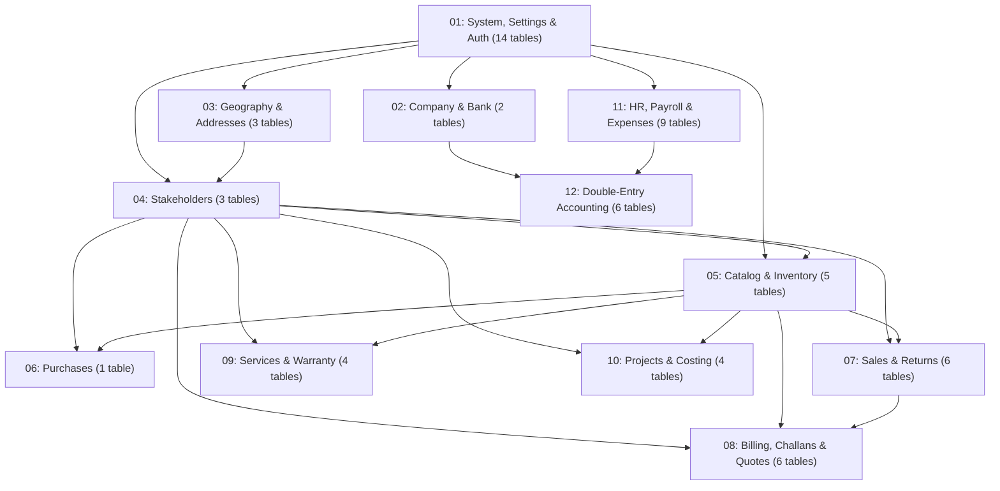

# 📦 Inoodex Inventory — Deep Project Analysis & Architecture Guide

> **App Name:** Inoodex Inventory (`APP_NAME=Inoodex Inventory`)  
> **Framework:** Laravel 10.x  
> **PHP Requirement:** ^8.1 / PHP 8.2+ / PHP 8.3  
> **Database:** MySQL (`inoodex_inventory`)  
> **Environment:** Local (Laragon / `127.0.0.1:8000`)  
> **Status:** Production Ready / Clean Baseline Migrations & Seeders  
> **Last Updated:** September 2026  

---

## 1. 🗂️ Project Overview

**Inoodex Inventory** is an enterprise-grade, multi-module Business ERP & Inventory Management System built on **Laravel 10**. Designed as a full-stack monolithic application with high cohesion and low coupling, it provides end-to-end management for wholesale, retail, workshop/service, and project-based enterprises.

### Core Capabilities:
- **Double-Entry Accounting Engine**: 5-Class Chart of Accounts (GAAP/IFRS compliant), multi-row split Journal Vouchers with live equilibrium validation, General Ledger, Trial Balance, Profit & Loss, Balance Sheet, Cash Flow, Contra Transfers, Bank Reconciliation, and Fiscal Year Closing.
- **Dynamic Letterhead & Background Pad Engine**: Per-company customizable invoice letterhead (`pad_image`) and report background (`report_bg_image`) with independent ON/OFF toggles for pre-printed stationary and vector PDF export via `carlos-meneses/laravel-mpdf`.
- **Inventory & Serial Number Tracking**: Serialized & bulk product tracking, barcode generation, multi-tier categories & brands, automated stock deduction and incrementing.
- **Sales, Procurement & Commercial Documents**: Complete lifecycle from Quotation $\rightarrow$ Sales Order $\rightarrow$ Delivery Challan $\rightarrow$ Invoice $\rightarrow$ Due Payment Collection; Purchases with Vendor management; and Project Billing.
- **Returns & Reversals**: Full return workflow (Pending $\rightarrow$ Approve $\rightarrow$ Complete) with automatic inventory restock and accounting Storno reversal entries.
- **Service & Workshop Management**: Repair ticketing, technician assignment, customer rating reviews, and service invoicing.
- **Project Management & Direct Costing**: Client projects, material tracking, direct expense allocation, milestone billing, and profitability analysis.
- **HR & Payroll**: Employee directory, monthly salary calculations, advance deductions, daily attendance, and an Employee Self-Service portal for TA/DA expense claims.
- **Unified Role-Based Access Control (RBAC)**: Powered by Spatie Permission (`Super Admin`, `Admin`, `Employee`) with unified permission seeding.

---

## 2. 🏗️ Architecture & Directory Layout

```
inoodex_inventory/
├── app/
│   ├── Console/Commands/      # Artisan commands (e.g., accounts:init-balances)
│   ├── Events/                # Real-time WebSocket events (e.g., SaleCreatedEvent)
│   ├── Exceptions/            # Custom exception handling (Handler.php with custom renderers)
│   ├── Helpers/
│   │   ├── helpers.php        # Global accounting & utility helpers (getPdfBackground, postJournalEntry, etc.)
│   │   └── NumberToWords.php  # Number to words converter for invoices & vouchers
│   ├── Http/
│   │   ├── Controllers/       # 54 Controllers (Sales, Accounts, Purchases, Service, HR, etc.)
│   │   ├── Middleware/        # ValidateFiscalYear, Spatie RBAC, auth guards
│   │   └── Kernel.php
│   ├── Mail/                  # Mailable classes (e.g., CreateSalesMail)
│   ├── Models/                # 54 Eloquent models (ChartOfAccount, JournalEntry, Sale, Product, etc.)
│   ├── Providers/             # Service providers (AppServiceProvider with Sanctum::ignoreMigrations)
│   └── Services/              # Dedicated business transaction services (SaleService, PurchaseService, etc.)
├── database/
│   ├── migrations/            # 12 clean, consolidated domain-grouped baseline migrations
│   ├── migrations_backup/     # Preserved legacy migrations archive (87 files)
│   ├── factories/             # Eloquent model factories
│   └── seeders/               # Master DatabaseSeeder, ChartOfAccountSeeder, PermissionSeeder, etc.
├── resources/
│   ├── views/
│   │   ├── frontend/          # Admin ERP views (Blade templates)
│   │   │   ├── layouts/       # master, sidebar, header, footer, head (unified branding)
│   │   │   └── pages/         # 38 module sections including /accounts/
│   │   ├── pdf/               # mPDF & DomPDF invoice, voucher, and ledger templates
│   │   │   └── accounts/      # Voucher, Ledger, Trial Balance, P&L, Balance Sheet templates
│   │   ├── auth/              # Bootstrap authentication views
│   │   └── errors/            # Custom branded error pages (403, 404, 419, 500, 503)
│   ├── css/, js/, sass/       # Asset sources
├── routes/
│   ├── web.php                # Main role-protected application routes (310 routes)
│   ├── api.php                # API endpoints
│   └── console.php            # Console route commands
├── public/                    # Web root, fallback final_pad.png, uploads (company_pads, products, etc.)
├── config/                    # Application, auth, permission, pdf configurations
└── storage/                   # Logs, framework cache, mPDF temporary files
```

### Key Design Patterns:
- **Service Layer Pattern**: Heavy transactional workflows (e.g. `SaleService`, `PurchaseService`) wrap database operations inside `DB::transaction()` to ensure atomicity across stock levels, payment records, and journal vouchers.
- **Domain-Grouped Baseline Migrations**: All 62 database tables are organized into 12 logically grouped, sequential migration files with strict foreign key cascading.
- **Dynamic Helper Abstraction**: `getPdfBackground()` centralized helper resolves letterhead images, respects company toggle switches, and falls back gracefully to system assets.

---

## 3. 🔑 Authentication & Spatie RBAC Authorization

### 3.1 Authentication
- Built on `laravel/ui` (Bootstrap scaffolding).
- **Public registration disabled** (`Auth::routes(['register' => false, 'reset' => false, 'verify' => false])`).
- Secondary administrative PIN verification mechanism (`/user/pin`).
- `laravel/sanctum` installed with `Sanctum::ignoreMigrations()` configured in `AppServiceProvider` to maintain clean migration boundaries.

### 3.2 Unified Role-Based Access Control (RBAC)
Managed by **Spatie Laravel Permission** (`spatie/laravel-permission ^6.3`) and seeded via a single unified `PermissionSeeder.php`:

| Role | Permissions Assigned | Scope & Purpose |
|------|----------------------|-----------------|
| **Super Admin** | **All 20 System Permissions** | Unrestricted access across all 38 modules, financial reports, system settings, user/role management, and double-entry accounting. |
| **Admin** | 18 Operational Permissions (Excludes `Administration`, `Settings`) | Full day-to-day operational control: Sales, Purchases, Inventory, Services, Projects, HR, Bills, and Reports. |
| **Employee** | Dashboard + TA/DA Self-Service Portal | Restricted staff view for logging personal travel/daily allowance claims. |

#### Application Permission Matrix (20 Permissions):
1. `Administration`
2. `Settings`
3. `Category Management`
4. `Product Management`
5. `Customer Management`
6. `Vendor Management`
7. `Purchase Management`
8. `Inventory Management`
9. `Warranty Management`
10. `Service Management`
11. `Sales Management`
12. `Accounts Management`
13. `Expense Management`
14. `Payment Management`
15. `Project Management`
16. `Client Management`
17. `Cost Management`
18. `Company Management`
19. `Report Management`
20. `Booking`

---

## 4. 📊 Deep Dive into Application Modules

### 4.1 📒 Double-Entry Accounting & Bookkeeping
A GAAP/IFRS-compliant double-entry accounting engine fully integrated with operational transactions.

| Model | Database Table | Description & Responsibilities |
|-------|----------------|--------------------------------|
| `ChartOfAccount` | `chart_of_accounts` | 5-Class hierarchical account chart: Asset (1000), Liability (2000), Equity (3000), Revenue (4000), Expense (5000). Linked to `BankDetail`. |
| `FiscalYear` | `fiscal_years` | Financial accounting periods with start/end dates, active status flag, and year-end closing locks. |
| `JournalEntry` | `journal_entries` | Immutable voucher headers with auto-sequencing `JV-YYYYMMDD-0001`, audit metadata, and Storno reversal foreign keys. |
| `JournalEntryItem` | `journal_entry_items` | Split debit and credit transaction lines with individual account allocations. |
| `ContraEntry` | `contra_entries` | Internal liquid fund transfers (Cash-to-Bank, Bank-to-Bank) with auto `CN-YYYYMMDD-0001` sequencing. |
| `AccountReconciliation` | `account_reconciliations` | Bank statement balance verification and variance tracking against General Ledger book balances. |

#### Financial Statements & Reports:
1. **Journal Voucher (JV) Interface**: Interactive multi-row split debit/credit creator with live client-side validation preventing un-balanced voucher submissions.
2. **General Ledger**: Chronological audit trail showing running balances, opening balance brought forward, date ranges, and mPDF export.
3. **Trial Balance**: Automatic debit vs. credit balance validation verifying equation equilibrium across all active accounts.
4. **Profit & Loss (P&L)**: Operating revenues (4000) minus operating expenses (5000) calculating Net Period Profit/Loss.
5. **Balance Sheet**: Fundamental accounting equation verification: $\text{Assets (1000)} = \text{Liabilities (2000)} + \text{Equity (3000)} + \text{Current Period Earnings}$.
6. **Cash Flow Statement**: Net liquid operating fund changes derived from Cash in Hand (1110) and Bank Accounts (1120).
7. **Fiscal Year Closing**: One-click year-end closing that automatically zeroes out temporary Revenue and Expense accounts into Owner Capital/Retained Earnings (`3100`/`3200`) and permanently locks the period.

---

### 4.2 🖼️ Dynamic Letterhead & Background Pad System
A centralized letterhead management system for all PDF outputs:

```
                  ┌────────────────────────────────────────────────────────┐
                  │                 Company Detail Record                  │
                  │  pad_image | report_bg_image | show_invoice_bg | ...   │
                  └──────────────────────────┬─────────────────────────────┘
                                             │
                       ┌─────────────────────┴─────────────────────┐
                       ▼                                           ▼
             Commercial Documents                        Financial & Ops Reports
      (Invoices, Bills, Challans, Quotes)          (Ledgers, P&L, Balance Sheet, Stock)
                       │                                           │
          `show_invoice_bg == true`?                   `show_report_bg == true`?
          ├── YES: Render `pad_image`                  ├── YES: Render `report_bg_image`
          └── NO:  Render Blank Canvas                 └── NO:  Render Blank Canvas
              (For Pre-Printed Pads)                       (For Plain Paper Printing)
```

- **Helper Method**: `getPdfBackground(?CompanyDetail $company, string $type = 'invoice'): ?string`
- **Fallback Chain**: Custom uploaded image $\rightarrow$ Default Company image $\rightarrow$ System Asset (`public/assets/invoice/final_pad.png`).
- **Base64 Data URI Conversion**: Directly streams vector/raster backgrounds into mPDF without file system permission bottlenecks.

---

### 4.3 🛒 Catalog & Inventory Management
| Model | Table | Key Fields & Capabilities |
|-------|-------|--------------------------|
| `Product` | `products` | `name`, `category_id`, `brand_id`, `model`, `barcode`, `photos` (JSON), `warranty`, `is_serialized` |
| `Inventory` | `inventories` | `product_id`, `opening_stock`, `current_stock` |
| `ProductSerial` | `product_serials` | Unique alphanumeric serial tracking per unit for warranty verification |
| `Category` | `categories` | Product taxonomy with full pagination support |
| `Brand` | `brands` | Manufacturer and brand profiles with pagination support |

- Dynamic pagination across all master listing tables (Categories, Brands, Products, Inventories).
- Automated stock decrement on sale completion and increment on purchase/return approval.

---

### 4.4 💰 Sales & Due Payment Collection
| Model | Table | Key Fields & Capabilities |
|-------|-------|--------------------------|
| `Sale` | `sales` | `order_no` (`INV-...`), `customer_id`, `total`, `payble`, `advanced_payment`, `due_payment`, `discount`, `vat`, `tax`, `delivery_charge`, `status` |
| `SalesItem` | `sales_items` | `product_id`, `unit_price`, `purchase_price`, `profit`, `qty`, `returned_qty` |
| `Payment` | `payments` | Transaction receipts linked to sales with payment type and audit tracking |
| `Customer` | `customers` | Customer CRM with credit limit and balance tracking |

- Automatic double-entry posting recognizing Revenue (4110), Cash (1110), and Accounts Receivable (1130).
- Real-time WebSocket broadcasting via `SaleCreatedEvent` (Pusher).

---

### 4.5 🛍️ Purchase & Procurement Module
| Model | Table | Key Fields & Capabilities |
|-------|-------|--------------------------|
| `Purchase` | `purchases` | `purchase_no`, `product_id`, `vendor_id`, `quantity`, `unit_price`, `sub_price`, `total_price`, `payment`, `due` |
| `Vendor` | `vendors` | Supplier profiles with contact and company info |

- Auto-increments warehouse inventory stock.
- Bulk and individual serial number registration for serialized products.
- Auto-posts double-entry vouchers recognizing Inventory Asset (1140), Cash (1110), and Accounts Payable (2110).

---

### 4.6 🔄 Product Returns & Storno Reversals
| Model | Table | Key Fields & Capabilities |
|-------|-------|--------------------------|
| `ProductReturn` | `returns` | `sale_id`, `customer_id`, `return_date`, `total_refund_amount`, `status`, `reason` |
| `ReturnItem` | `return_items` | `product_id`, `quantity`, `unit_price`, `condition`, `return_reason` |

- Workflow: `pending` $\rightarrow$ `approve()` $\rightarrow$ `complete()`.
- On completion: Restocks inventory, reduces sale receivable/payable, creates negative refund payment, and posts double-entry Storno reversal.

---

### 4.7 🔧 Service & Workshop Management
| Model | Table | Key Fields & Capabilities |
|-------|-------|--------------------------|
| `Service` | `services` | `customer_id`, `product_name`, `product_number`, `details`, `total`, `bill`, `paid_amount`, `due_amount`, `remarks`, `warranty_duration`, `repaired_by`, `status` |
| `RatingReview` | `rating_reviews` | Technician rating and customer service feedback |

- Service ticketing and repair lifecycle tracking.
- Generates dedicated service invoices and receipts with double-entry Service Revenue (4120) recording.

---

### 4.8 📁 Project Management & Direct Costing
| Model | Table | Key Fields & Capabilities |
|-------|-------|--------------------------|
| `Project` | `projects` | `project_name`, `client_id`, `budget`, `sub_total`, `discount`, `grand_total`, `advanced_payment`, `due_payment`, `status` |
| `ProjectItem` | `project_items` | Materials and items allocated to the project |
| `ProjectCost` | `project_costs` | Direct project cost line items linked to `CostCategory` |
| `Client` | `clients` | Corporate client CRM |

- Tracks project budgeting vs. actual cost incurred.
- Milestone billing and project bill generation.
- Auto-posts Direct Project Cost expenses (5230) to the General Ledger.

---

### 4.9 📄 Commercial & Billing Documents
- **Bills (`Bill` / `BillItem`)**: Supports `project`, `sale`, `purchase`, `vendor`, and `general` billing formats with `{PREFIX}-{YYYYMMDD}-{0001}` numbering.
- **Challans (`Challan` / `ChallanItem`)**: Delivery goods dispatch notes with recipient details and corporate letterheads.
- **Quotations (`Quotation` / `QuotationItem`)**: Client price proposals with expiration tracking, terms and conditions, and one-click PDF generation.

---

### 4.10 👨‍💼 HR & Payroll Management
| Model | Table | Key Fields & Capabilities |
|-------|-------|--------------------------|
| `Employee` | `employees` | `employee_id`, `user_id`, `name`, `email`, `phone`, `designation`, `join_date`, `salary`, `image` |
| `Salary` | `salaries` | Monthly payroll calculation (`basic_salary + allowance - deduction - advance`) |
| `AdvanceSalary` | `advance_salaries` | Staff advance salary requests |
| `Attendance` | `attendances` | Daily staff attendance logging |
| `TaDa` | `ta_das` | Travel Allowance & Daily Allowance entries |

- Self-service Employee portal for TA/DA claim submission.
- Monthly salary disbursement posting to Salary Expense (5210).

---

### 4.11 🏦 Company Profiles & Bank Accounts
- **`CompanyDetail`**: Multi-branch corporate details, logo, signature image, seal image, custom invoice pad, and report background configurations with independent toggle controls.
- **`BankDetail`**: Multi-bank account profiles linked directly to Chart of Accounts (1120) with default account selection.

---

### 4.12 ⚙️ Dynamic System Settings & Brand Engine
- **`Setting`**: Centralized key-value configuration system with zero-overhead caching (`Cache::rememberForever('app_settings_cache', ...)`).
- **Brand & Media Management**: Dynamic runtime management of Main Navbar Logo (`site_logo`), Dark/White Logo (`site_logo_white`), Login Screen Logo (`login_logo`), and Browser Favicon (`favicon`).
- **General & Localization Config**: Site Name, App Tagline, Official Email, Support Phone, Physical Address, Footer Copyright Text, Currency Symbol (`৳`), Currency Code (`BDT`), Date Format, and Timezone.
- **Global Helper Accessors**: `getSetting($key, $default)` and `setSetting($key, $value, $group, $type)` available across all controllers, middleware, and Blade views.

---

## 5. 🗄️ Consolidated Database Migrations (12 Domain Baseline Files)

All 63 database tables are consolidated into **12 clean, domain-grouped baseline migrations**:



### Table Breakdown by Migration File:

| # | Migration File | Tables Covered | Key Entities / Schema Details |
|---|---|---|---|
| **01** | `2024_01_01_000001_create_system_and_auth_tables.php` | 14 tables | `users`, `password_reset_tokens`, `password_resets`, `failed_jobs`, `personal_access_tokens`, `sessions`, `notifications`, `activity_logs`, `permissions`, `roles`, `model_has_permissions`, `model_has_roles`, `role_has_permissions`, `settings` |
| **02** | `2024_01_01_000002_create_company_and_bank_details_tables.php` | 2 tables | `company_details` (pad_image, report_bg_image, toggles, signature, seal), `bank_details` (account_no, branch, status) |
| **03** | `2024_01_01_000003_create_geography_and_address_tables.php` | 3 tables | `districts`, `areas`, `addresses` |
| **04** | `2024_01_01_000004_create_stakeholders_tables.php` | 3 tables | `customers`, `vendors`, `clients` |
| **05** | `2024_01_01_000005_create_catalog_and_inventory_tables.php` | 5 tables | `categories`, `brands`, `products` (barcode, photos, serialization), `product_serials`, `inventories` |
| **06** | `2024_01_01_000006_create_purchases_tables.php` | 1 table | `purchases` (`purchase_no`, product_id, vendor_id, soft deletes) |
| **07** | `2024_01_01_000007_create_sales_and_returns_tables.php` | 6 tables | `sales`, `sales_items` (`returned_qty`), `daily_sales`, `payments`, `returns`, `return_items` |
| **08** | `2024_01_01_000008_create_billing_challans_and_quotations_tables.php` | 6 tables | `quotations`, `quotation_items`, `challans`, `challan_items`, `bills`, `bill_items` |
| **09** | `2024_01_01_000009_create_services_and_warranty_tables.php` | 4 tables | `bookings`, `services`, `warranty_claims`, `warranty_claim_logs` |
| **10** | `2024_01_01_000010_create_projects_and_costing_tables.php` | 4 tables | `projects`, `project_items`, `cost_categories`, `project_costs` |
| **11** | `2024_01_01_000011_create_hr_payroll_and_expenses_tables.php` | 9 tables | `employees`, `attendances`, `salaries`, `advance_salaries`, `ta_das`, `expense_categories`, `daily_expenses`, `revenues`, `extras` |
| **12** | `2024_01_01_000012_create_double_entry_accounting_tables.php` | 6 tables | `chart_of_accounts`, `fiscal_years`, `journal_entries`, `journal_entry_items`, `contra_entries`, `account_reconciliations` |

---

## 6. 🌱 Master Seeder Architecture

The database is seeded through a structured pipeline in `database/seeders/DatabaseSeeder.php`:

```php
public function run(): void
{
    $this->call(UserSeeder::class);           // Creates root admin accounts
    $this->call(PermissionSeeder::class);     // Creates 20 permissions & 3 roles, assigns to Super Admin
    $this->call(SettingSeeder::class);        // Seeds default logos, favicon, brand names, and currency
    $this->call(ChartOfAccountSeeder::class); // 14 GAAP accounts + active FiscalYear + linked BankDetail
    $this->call(CategorySeeder::class);       // Core catalog categories
    $this->call(BrandSeeder::class);          // Core catalog brands
    $this->call(VendorSeeder::class);         // Initial vendor profiles
    $this->call(CustomerSeeder::class);       // Initial customer profiles
    $this->call(ProductSeeder::class);        // Initial product catalog
    $this->call(PurchaseSeeder::class);       // 10 demo purchase records with vendor allocations
    $this->call(SaleSeeder::class);           // 10 demo sales records with sales_items and payments
}
```

### Simplified Chart of Accounts Initial Ledger (14 Core Accounts):
- **1000 ASSETS (Debit)**
  - `1110` Cash in Hand
  - `1120` Bank Accounts (Linked to default `BankDetail`)
  - `1130` Accounts Receivable
  - `1140` Inventory Asset
  - `1210` Equipment & Furniture
- **2000 LIABILITIES (Credit)**
  - `2110` Accounts Payable
  - `2120` Salaries Payable
  - `2130` Tax & VAT Payable
- **3000 EQUITY (Credit)**
  - `3100` Owner's Capital
  - `3200` Retained Earnings
- **4000 REVENUE (Credit)**
  - `4110` Sales Revenue
  - `4120` Service Revenue
- **5000 EXPENSES (Debit)**
  - `5110` Cost of Goods Sold (COGS)
  - `5210` Salary Expense
  - `5220` Rent & Utility Expense
  - `5230` Project & Direct Costs

---

## 7. 📦 Key Dependencies & Technology Stack

### Backend
| Package | Version | Purpose |
|---------|---------|---------|
| `laravel/framework` | ^10.10 | Core MVC framework |
| `laravel/ui` | ^4.4 | Bootstrap auth scaffolding |
| `laravel/sanctum` | ^3.3 | API token authentication |
| `spatie/laravel-permission` | ^6.3 | Role-Based Access Control |
| `carlos-meneses/laravel-mpdf` | ^2.1 | Vector PDF generation with custom letterhead pads |
| `barryvdh/laravel-dompdf` | ^3.1 | Secondary PDF export utilities |
| `cviebrock/eloquent-sluggable` | ^10.0 | SEO slug generation |
| `guzzlehttp/guzzle` | ^7.8 | HTTP client |
| `pusher/pusher-php-server` | ^7.2 | Real-time WebSocket notifications |
| `twilio/sdk` | ^8.3 | SMS notifications |
| `anhskohbo/no-captcha` | ^3.6 | Google reCAPTCHA v2/v3 |
| `paytrail/paytrail-php-sdk` | ^2.7 | Payment gateway integration |

### Frontend
- **Blade Templating Engine** with reusable layouts and nested components
- **Bootstrap 5 & Feather Icons (`fe fe-*`) / FontAwesome 5/6 (`fas fa-*`)**
- **Vanilla JavaScript** with dynamic DOM calculators for journal split lines, balance reconciliations, and live equilibrium checks
- **Vite** asset bundling

---

## 8. 🛣️ Route Architecture Summary (310 Total Routes)

| Route Prefix / Group | Primary Controllers | Key Functionalities |
|----------------------|---------------------|---------------------|
| `/` | `FrontendController` | Main administrative dashboard & analytics |
| `accounts/*` | `ChartOfAccountController`, `JournalEntryController`, `LedgerController`, `TrialBalanceController`, `FinancialStatementController`, `ContraEntryController`, `ReconciliationController`, `FiscalYearController` | Full Double-Entry Accounting module (32 routes) |
| `sales/*` | `SalesController` | Sales orders, invoice generation, due payment processing, reports |
| `purchase/*` | `PurchaseController` | Procurement entries, latest purchase price queries, purchase reports |
| `inventory/*` | `InventoryController`, `ProductSerialController` | Stock monitoring, serial lookups, PDF inventory list |
| `service/*` | `ServiceController`, `PaymentController` | Workshop repair ticketing, completion, rating submissions, invoice PDFs |
| `projects/*` | `ProjectController`, `ProjectItemController`, `ProjectCostController`, `ProjectBillController` | Projects, bill creations, milestone payments |
| `bills/*`, `challans/*`, `quotations/*` | `BillController`, `ChallanController`, `QuotationController` | Document generators with PDF export |
| `product-returns/*` | `ReturnController` | Return lifecycle management (create, approve, complete, reject) |
| `employees/*`, `salary/*`, `ta-da/*` | `EmployeeController`, `SalaryController`, `TaDaController` | HR staff management, monthly salary run, TA/DA approvals |
| `employee/tada/*` | `EmployeeTaDaController` | Employee portal for self-service TA/DA entry |
| `users/*`, `role/*`, `permission/*` | `UserController`, `RoleController`, `PermissionController` | System security, user profiles, PIN settings |
| `bank-details/*`, `company-details/*` | `BankDetailController`, `CompanyDetailController` | Company configuration, custom pads, and default bank selection |
| `daily-expenses/*`, `expense-categories/*` | `ExpenseController`, `ExpenseCategoryController` | Operational daily expenses |

---

## 9. 📋 Setup, Installation & Maintenance

```bash
# 1. Clone repository and install dependencies
composer install
npm install

# 2. Configure environment file (.env)
cp .env.example .env
php artisan key:generate

# 3. Configure Database (.env)
DB_CONNECTION=mysql
DB_HOST=127.0.0.1
DB_PORT=3306
DB_DATABASE=inoodex_inventory
DB_USERNAME=root
DB_PASSWORD=

# 4. Run clean consolidated database migrations & seeders (all 62 tables & seeders)
php artisan migrate:fresh --seed

# 5. Initialize operational opening balances (if importing legacy transactions)
php artisan accounts:init-balances

# 6. Build assets and run development server
npm run build
php artisan serve
```

> **Default Local Server URL:** `http://127.0.0.1:8000`  
> **Default Admin Account:** `hello@inoodex.com` / `admin@example.com`

---

*Document Version:* 2.0  
*Maintained by:* Antigravity AI Engineering Assistant  
